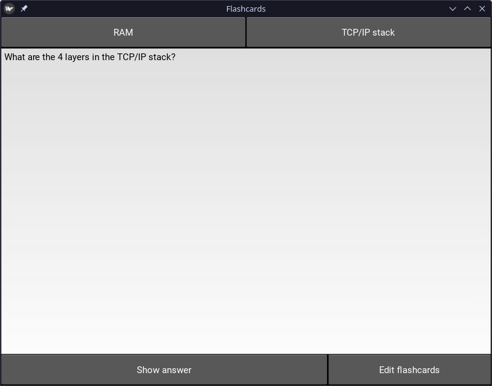
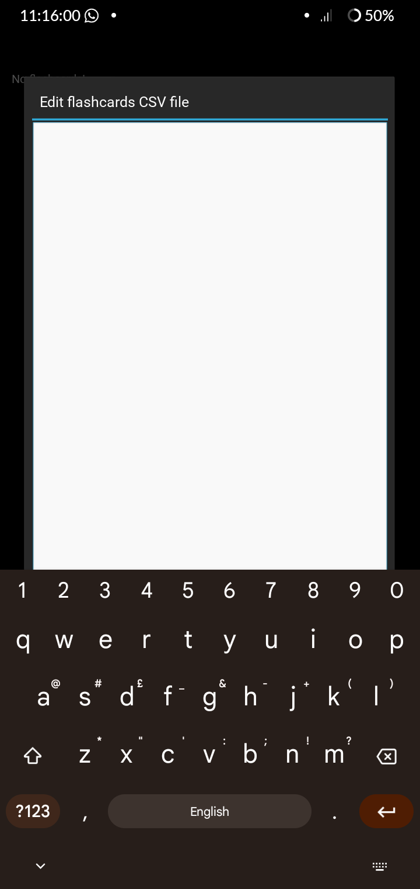

# Kivy flashcard program

## Installation

The program is currently in development, so the easiest way to run it on desktop platforms is by following the [development instructions](#development-instructions).

### Android

The program can also be run as an Android app. Debug builds are available from the [Releases tab](https://github.com/RandomSearch18/kivy-flash-cards/releases)

## Screenshots

## Development instructions

### Running on desktop Linux

1. `python3 -m venv .venv`
2. Activate venv
3. `pip install -r requirements.txt`
4. Run `src/main.py`

### Building for Android

1. Clone the [Buildozer](https://github.com/kivy/buildozer) repo, change directory into it, and build the docker image with `docker build --tag=kivy/buildozer .`
2. Change directory back to this repo, run and build a debug APK with `docker run -v $HOME/.cache/buildozer:/home/user/.buildozer -v $(pwd):/home/user/hostcwd kivy/buildozer android debug`
3. Copy the APK from the `bin/` directory to your Android device and install it

By default, the APK will be built for `arm64-v8a` devices. This can be changed in `buildozer.spec`.
